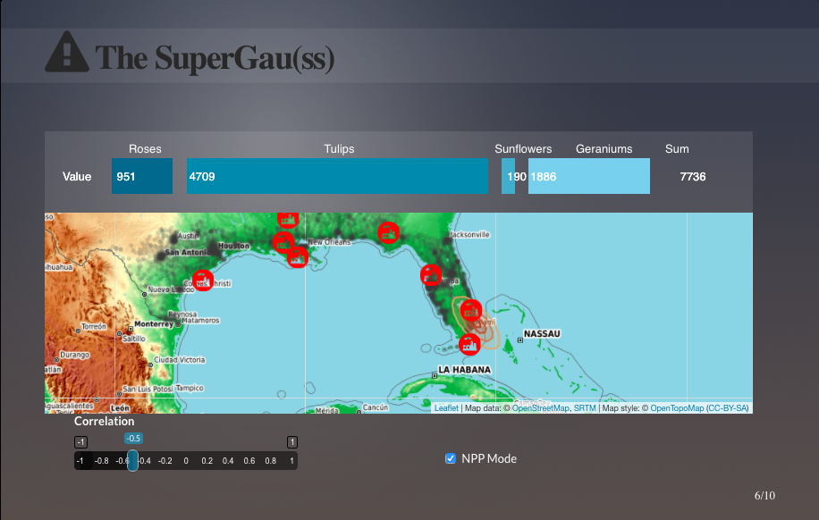
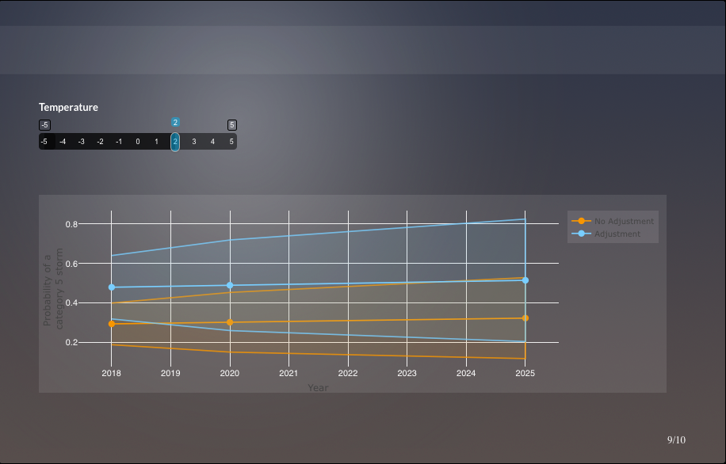
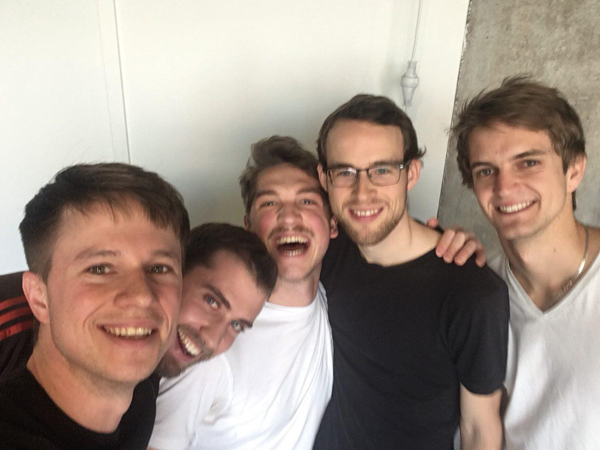

On the weekend of November 17. - 19. five brave data-knights from team “Rtus and the knights of the data.table” took on the challenge to compete in a datathon organized by Munich Re in its Munich-based innovation lab. Team Rtus was formed in April this year by a bunch of statistics students from LMU with the purpose to prove their data-skills in competitions with other teams from various backgrounds. The datathon was centered around the topic “the effects of climate change and hurricane events on modern reinsurance business” and after two days of very intensive battles with databases, web-crawlers and advanced machine learning modelling (using the famous R-library [mlr](https://mlr-org.github.io/mlr/)), they managed to prevail against strong professional competitors and won the best overall price. After victories at the [Datafest at Mannheim University](https://hiwissml.github.io/datafest2017.github.io/) and the [Telefonica data challenge](https://www.tefdatachallenge.com/) earlier this year, this was the last step to a hattrick for the core members of team Rtus.

<!--more-->

Their way to success was the implementation of an interactive web-app that could serve as a decision support system for underwriting and tariffing units at Munich Re that are dealing with natural catastrophies. Munich Re provided the participants with databases on claims exposure in the Florida-bay, footprints of past hurricanes and tons of data on climate variable measurements over the past decades. One of the core tasks of the challenge was to define and calculate the maximum foreseeable loss and the probability of such a worst-case event to take place.

To answer the first question, they created a web app that calculates the expected loss of a hurricane in a certain region. To give the decision makers the opportunity to include their expert domain knowledge, they could interact with the app and set the shape and the location of the hurricane, which was modelled as a spatial Gaussian process. This is depicted in the first screenshot. Due to a NDA the true figures and descriptions in the app were altered.

The team recognised the existence of several critical nuclear power plants in this area. The shocking event of Fukushima in 2011 showed the disastrous effects that storm surges, a side effect of hurricanes, can have in combination with nuclear power plants. To account for this, team Rtus implemented the “Nuclear Power Plant” mode in the app. The function of this NPP-mode is shown in this figure:

In a next step, the team tried to provide evidence for the plausibility of such a worst-case event. The following image, based on the footprints of past hurricanes, shows that there were indeed hurricanes crossing the locations of the nuclear power plants:

To answer the second part of the question, they also created a simulation of several weather variables to forecast the probability of such heavy category 5 hurricane events. One rule of reliable statistic modelling is the inclusion of uncertainty measures in any prediction, which was integrated via the prediction intervals. Also, the user of the simulation is able to increase or decrease the estimated temperature trend that underlies the model. This screenshot illustrates the simulation app:

The 36 hours of intensive hacking, discussions, reiterations and fantastic team work combined with the consumption of estimated 19.68 litres of Club Mate were finally rewarded with the first place ranking and a Microsoft Surface Pro for each of the knights. “We will apply this augmentation of our weapon arsenal directly in the next data battle”, one of the knights proudly stated during the awards ceremony.

This portrait shows the tired but happy data knights (from left to right: Niklas Klein, Moritz Herrmann, Jann Goschenhofer, Markus Dumke and Daniel Schalk):

